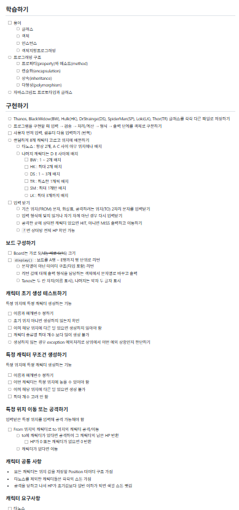
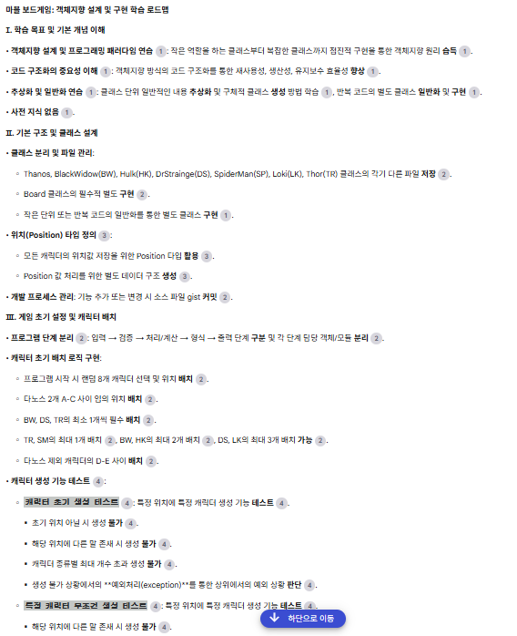
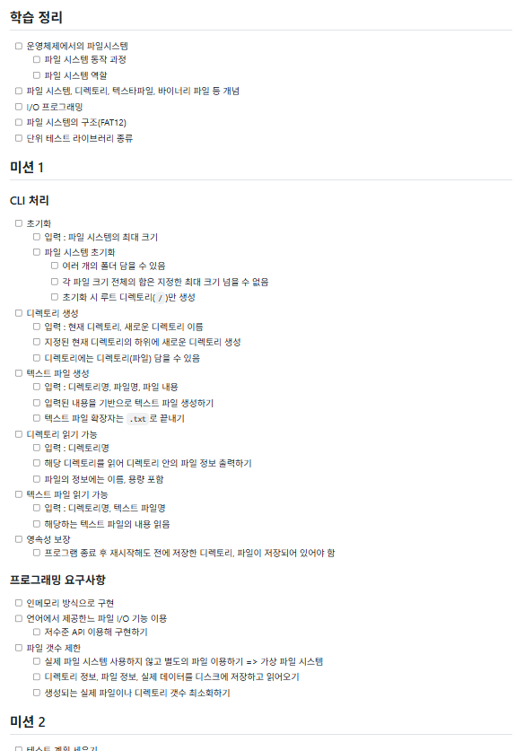
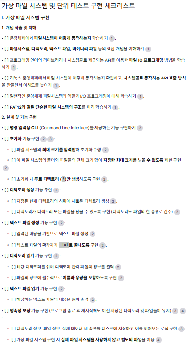

# Week01

---

`J059 김윤서` `J093 노주영` `J142 송민우` `S012 박진홍`

| 시간          | 활동            | 활동 설명                                                                   |
| ------------- | --------------- | --------------------------------------------------------------------------- |
| 13:00~14:00   | 부캠 라디오 📻  | 릴레이 프로젝트의 목적과 방법을 구두로 안내합니다. 라운지로 모이세요!       |
| 14:00~15:00   | 토론하기        | 어떤 프로젝트를 하면 좋을지 토론하며 좁혀 나갑니다.                         |
| 15:00~16:00   | 조사하기        | 토론 내용을 바탕으로 실제로 시도할 수 있는 방안, 참고 자료 등을 조사합니다. |
| 16:00~17:00   | 퀘스트 제작하기 | 한 주 동안 수행할 4개의 퀘스트를 만들어 릴레이 노트에 정리합니다.           |
| 🔁            | 릴레이          | 이어받을 퀘스트 노트를 확인하세요.                                          |
| 17:00~18:00   | 퀘스트 이어받기 | 다른 팀이 만든 퀘스트를 이어받고, 해석하고, 수행 계획을 세웁니다.           |
| 다음 릴프까지 | 퀘스트 수행하기 | 한 주간 퀘스트를 수행하고, 과정을 기록합니다.                               |

## 토론

---

### 1. 미션 난이도

- 공통의견: 쉽지않다. 시간 내 미션 완수는 물론 기능 완전 구현만도 어렵기 십상이다

### 2. 피어 세션

- 공통의견: 빡빡하다. 미션 관련 내용과 어려웠던 부분 등 핵심 주제를 이행하면 빠듯할 정도

### 3. 커뮤니티

- 공통의견: 슬랙에 다양한 정보와 참고사항들이 올라오지만 미션 수행에 바빠 활용하지 못하는 경우가 많다

### 4. 목표 집중

- 공통의견: 명확한 목표를 설정하고 리마인드하지 않으면 빠질 곁가지가 많다.  
  명확하게 로드맵이나 플로우를 설정하지 못하면 야크 털 깎기를 실천하게 되니 항상 주의하게 된다

## 공통점

다양한 이유(경험 부족, 지식 부족, 정보 포화 ...)로 시간이 부족함을 느낌.  
더 효율적으로 학습하고 구현할 수 있도록 여유시간을 제공해 줄 보조적 도구의 필요성 자각.

# 주제별 정리 및 보완 - 마크다운 소스 코드 라인

---

## 1. 슬랙/블로그 자료 많음, 효율적 선별법 고민

- 핵심: 자료가 너무 많아 어디서부터 봐야 할지 모호
- 보완:
  1. 내 지스트에서 부족한 키워드 추출
  2. 슬랙/블로그 자료 키워드와 매칭
  3. 부족한 주제 우선순위 부여해 읽기
- 한 줄 요약: "내가 부족한 개념에 대한 자료만 선별적으로 체크하자."

## 2. 서로의 지스트 비교

- 핵심: 지식 구조와 놓친 부분 확인
- 보완: 교차 점검 체크리스트 작성 및 비교
- 한 줄 요약: "지스트 비교 체크리스트를 작성해 서로의 지식을 보완하자."

## 3. 리드미 가시성, 가독성 향상

- 핵심: 리드미의 명확한 구조와 시각적 가독성
- 보완: TOC, 섹션별 요약, 표, 코드 블록, 강조 사용
- 한 줄 요약: "리드미는 목차-섹션 요약-시각적 강조로 시각적 맵을 만들어라."

## 4. 질문 챗봇 만들기

- 핵심: 맞춤형 질문 답변 자동화
- 보완: 자주하는 질문과 오답을 챗봇에 학습시켜 피드백 받기
- 한 줄 요약: "내가 자주 궁금해 하는 질문을 챗봇에 직접 등록해 맞춤형 답변 받기."

## 5. 직접 설명하고 검사받기

- 핵심: 제대로 이해했는지 확인
- 보완: 개념을 내 언어로 설명 후 피드백 요청
- 한 줄 요약: "핵심 개념을 내 말로 설명하고 즉시 검증받자."

## 6. 토의 주제 추천 및 실행

- 핵심: 토의할 주제 선정이 어려움
- 보완: 헷갈리거나 새로운 주제 미리 리스트 작성 후 선정
- 한 줄 요약: "내 약점이나 신기술 등 토의할 주제를 선제적으로 뽑자."

## 7. 피어 컴파일링 시간 부족 문제

- 핵심: 모든 내용을 꼼꼼히 알기 어려움
- 보완: 핵심만 정리해 교환하고 질문-답변 로그 관리
- 한 줄 요약: "핵심만 요약해 공유하고 질문과 답변을 기록하자."

## 8. 미니 학습 커리큘럼 및 로드맵

- 핵심: 체계적인 학습 순서 필요
- 보완: 학습 완료 및 남은 주제 시각적 타임라인 제작
- 한 줄 요약: "학습 이력과 앞으로 남은 주제를 한눈에 볼 수 있게 하자."

## 9. 친해지길 바라

- 핵심: 친목 도모 및 분위기 조성
- 보완: 재밌고 가벼운 질문 또는 취향 공유 주제 준비
- 한 줄 요약: "가벼운 취향이나 근황 질문으로 분위기를 풀자."

## 10. 토의·회의 내용 문서화 및 저장

- 핵심: 논의 내용 휘발 방지 및 활용
- 보완: 슬랙 스레드, 마크다운 노트, 정리 담당 지정
- 한 줄 요약: "모든 논의 내용을 반드시 짧게 요약해 문서화하자."

## 11. 커뮤니티 참여 활성화 위한 퀘스트 제공

- 핵심: 참여 저조 문제 해결
- 보완: 소규모 미션, 발표, 질문 등 참여 유도 퀘스트 제안
- 한 줄 요약: "작은 참여 미션으로 커뮤니티 활성화를 유도하자."

## 12. 자존감 관리와 긍정 강화

- 핵심: 자존감 저하를 방지하고 회복
- 보완: 주간 잘한 점 기록·공유하며 자기 강화
- 한 줄 요약: "내가 잘한 점을 스스로 기록하고 칭찬하자."

## 조사

---

`8번` 아이디어 - 미니 학습 커리큘럼 및 로드맵

- 핵심: 체계적인 학습 순서 필요
  - `우리에게 주어진 주제와 사전 정보만으론 학습의 순서나 기본적인 배경 지식을 알기 어려움`
  - `제시된 정보를 기반으로, 목표를 달성하기 위한 추가적인 정보와 자료, 가이드라인 필요`
- 보완: 학습 완료 및 남은 주제 시각적 타임라인 제작
- `방식`: 07-18 목 17:24 @J090\_남효율 캠퍼님이 남긴 스레드 참고 - NotebookLM
  - 특징
    - 채팅 내용을 학습하지 않기에 미션 유출 차단
    - 최근 강화된 ‘웹 탐색 및 추천’ 기능
    - 제공 소스 기반 답변을 통한 할루시네이션 최소화
    - 제공 소스 출처 명시를 통한 검증 용이
    - Discover Sources 기능 추가에 따른 확장성 있는 학습 가능
- 과정
  - 제공된 미션의 학습 목표와 중점, 참고 자료를 기반으로
  - 목표 달성과 기능 구현을 위해 필요한 학습 로드맵과 참고 자료들을 탐색
  - 추가 학습 및 보완 자료 필요시 웹 탐색 기능을 활용, 데이터 리서치 진행
- 기대 효과
  - 막연한 학습 주제에 대한 접근성 향상
  - 불명한 학습 과정과 주제 명확화
  - 제공된 순차적 학습 가이드라인을 통한 효율적 학습, 학습 시간 단축
  - 효율적 학습을 통한 요구사항 충족 및 구현, 성공적인 미션 완수

---

`9번` 아이디어 - 친해지길 바라

- 문제
  - 매주 새로운 그룹을 만나 일주일만에 헤어지는 캠퍼들은, 서로 미션 피드백하기에 바빠 친해질 시간이 부족하다.
  - 친해질 때쯤 그룹이 바뀐다.
  - 어색한 분위기는 활발한 피드백을 저해하는 요소이다.
- 어떻게 개선할까?
  - “개발자”여서 공감할 수 있는 서로의 성향 체크(당신은 에겐코더? 테토코더?)
  - 서로의 TMI 공유하기
- AI가 이 문제를 어떻게 해결할 수 있을까?
  - 팀 빌딩 때만 Zoom 회의 내용을 전사 → AI가 실시간으로 리스닝하면서 중간중간 채팅으로 껴들기 (AI가 바람잡이 역할)
  - 진지한 대화 하는데 분위기 파악 못하고 끼어드는 것을 방지하기 위해 10분 스누즈 기능
- 실현 가능한가?
  - AI 아바타를 화상회의에 참석시킨 사례
    (AI가 회의 내용을 듣고 대답한다. AI는 카메라는 켜지 않고 채팅으로만 한번씩 참여하도록 하면 좋을듯)
    - https://www.threads.com/@choi.openai/post/DBiNWJxptyk/video-ai로만-이루어진-화상회의에-참여하면-발생하는-일-위에-가운데-사람만-실제-사람입니다

---

`3번` 아이디어 - WRITE README

### AI 활용 리드미 서식 개선 및 이미지 대체 기능

- _핵심:_
  - 자연어 초안, 장문의 설명 등 비구조적 리드미를 AI가 자동으로 마크다운 서식화하고, 시각적으로 한눈에 보기 좋게 변환하는 기능.
- _보완:_
  - 불필요하게 긴 설명, 구조 없는 목록, 복잡한 텍스트 등은 이해와 공유에 방해가 되므로, 서식 자동화 및 이미지 변환이 필요하다.
- _방식:_
  1. _AI 기반 서식 자동화_
  - 리드미 초안을 AI에 입력하면 자동으로 목차, 굵게, 리스트, 표, 코드블록 등 마크다운 스타일링 제공.
  2. _내용 요약 및 시각 강조_
  - 긴 설명이나 복잡한 구조를 섹션별 한 줄 요약으로 재구성, 개념 비교나 단계별 흐름을 표, 계층도 등 구조화.
  3. _이미지/도식 자동 생성_
  - 복잡한 설명은 AI가 자동으로 플로우차트, 타임라인 등 그림으로 변환(mermaid, draw.io 등과의 연동 또는 자체 생성).
- _과정:_
  1. 사용자는 자연어 형태의 리드미 초안을 AI에 입력한다.
  2. AI가 자동으로 가독성 높은 마크다운 서식(목차, 구분선, 표, 코드블록, 강조 등)으로 변환한다.
  3. 설명이 난해한 부분이나 비교가 필요한 구조는 자동으로 표 또는 다이어그램(이미지)로 재가공해서 첨부한다.
  4. 복잡한 구조 설명이 요구될 경우, AI가 플로우차트 등 이미지를 별도로 생성해서 리드미 내에 배치한다.
- _기대 효과:_
  - 리드미의 가시성과 가독성이 획기적으로 상승
  - 정보를 빠르고 명확하게 파악할 수 있고, 요점 및 구조를 한눈에 확인 가능
  - 협업 시 혼돈을 줄이고 문서 전달력 강화
  - 반복 작업 없이 효율적으로 리드미/설명자료 완성

---

`1번` 아이디어 - 학습 피드백

- 핵심: 내 학습이 맞는 방향인지, 빼먹거나 잘못된 부분이 있지 않을지 의심스러움
- 보완: 내 학습 내용에 대한 피드백을 통해 개선점을 파악하고 확신을 가짐
- 방식:
  1. NotebookLM / Perplexity 등 AI 모델의 도움을 받아 학습 결과 정리, 필요시 요약해 전처리
  2. 미션 내용은 제외하고 목표로 하는 기능과 핵심 학습 목표, 전처리된 데이터 전달
  3. 개선점/보완점 등 피드백 제공
- 과정:
  1. 미션을 구현하기 위한 지식 ↔ 실제 작성한 코드와 학습 문서 비교, 진단
  2. 코드의 개선점/문서의 보완점 등을 제시
  3. 개선/보완 방안과 활용 가능한 자료 제공
- 기대 효과:
  1. 다른 길로 새거나 잘못된 정보를 학습하는 일 방지
  2. 다음 목표나 추가 학습 자료 탐색 용이
  3. 신뢰성 있는 자료를 활용한 피드백으로 스스로의 학습에 대한 불신 해소

---

`9번` 아이디어 - 친해지길 바라

- 문제:

  - 매주 새로운 그룹을 만나 일주일만에 헤어지는 캠퍼들은, 서로 미션 피드백하기에 바빠 친해질 시간이 부족하다.

  - 친해질 때쯤 그룹이 바뀐다.

  - 어색한 분위기는 활발한 피드백을 저해하는 요소이다.

- 어떻게 개선할까?

  - “개발자”여서 공감할 수 있는 서로의 성향 체크(당신은 에겐코더? 테토코더?)
  - 서로의 TMI 공유하기

- AI가 이 문제를 어떻게 해결할 수 있을까?

  - 방법1.
    - 팀 빌딩 때만 Zoom 회의 내용을 전사 → AI가 실시간으로 리스닝하면서 중간중간 채팅으로 껴들기 (AI가 바람잡이 역할)
    - 진지한 대화 하는데 분위기 파악 못하고 끼어드는 것을 방지하기 위해 10분 스누즈 기능
  - 방법2.
    - 새로운 그룹이 결성되면 슬랙 봇이 한주간 마니또로 지낼 사람을 골라줌(gist 내용 기반 성향을 파악해서)

- 실현 가능한가?
  - AI 아바타를 화상회의에 참석시킨 사례 (AI가 회의 내용을 듣고 대답한다. AI는 카메라는 켜지 않고 채팅으로만 한번씩 참여하도록 하면 좋을듯)
    https://www.threads.com/@choi.openai/post/DBiNWJxptyk/video-ai로만-이루어진-화상회의에-참여하면-발생하는-일-위에-가운데-사람만-실제-사람입니다

---

5번 학습 피드백 받기  
배경: 학습한 내용을 자기 것으로 지식화 했는지, 내 언어로 다시 표현할 수 있는지 검사받기

복습을 위한 학습 방식

- 자체 제작 퀴즈
- 플래시 카드
- 페인먼트 기법
  - 빈 종이에 비전공자에게 해줄 설명을 써나가기
- 개념 지도 그리기
- 동료에게 미니 강의 해주기

AI를 어떻게 활용하면 좋을까

- 학습한 내용 복사해 붙여넣지 말고, AI에게 비전공자로 역할을 부여한 뒤 설명을 해나가는 방식
  - AI가 기초 지식이 없을 때를 가정해 하는 질문들로 논리의 연결이 끊어진 부분을 쉽게 찾을 수 있지 않을까
- 학습 질문에 대한 템플릿 만들어 받기
- 비판적으로 검토 받기
  - 비판적인 피드백은 많이 받으면서 익숙해져야 할 포인트
  - 연구진은 "대학 수준의 언어 과정에 LLM 기반 피드백 도구를 통합하면 에세이 품질과 작문 과제에 대한 학생 참여도를 향상시킬 수 있다"며 "교육자들은 AI 피드백에 대한 학생들의 혼합된 감정적 반응을 인식하고, 부정적 경험을 완화하기 위한 추가 지원을 제공해야 한다"고 권고했다.
  - 이에 따라 너무 비판적이거나 부정적인 측면, 비판을 위한 비판은 자제하도록 프롬프트를 작성해야 할 듯

---

10번 토의 요약 기록

1. 배경

- 생산성 높은 토의를 진행하더라도 기록이 부족해 핵심 논의 사항·결정 사항·아이디어가 사라짐
- 회의 결과를 조직 전체에 공유하고, 기여한 사람을 적절히 칭찬·동기부여

2. 목적

1) 완전한 캡처: 음성 녹음 → 텍스트 스크립트 변환
2) 자동 요약·인사이트: 핵심 의사결정·액션 아이템 식별
3) 피드백·칭찬: 기여도 높은 참여자 공식 지정·칭찬
4) 신속 배포: 회의 직후 요약본 전사·팀 공유

3. 요구 기능

| 구분        | 필수                       | 추가               | 비고                      |
| ----------- | -------------------------- | ------------------ | ------------------------- |
| 음성→텍스트 | 회의 녹음·스크립트 추출    | 실시간 변환        | 한국어 지원 필수          |
| 자동 요약   | 핵심 문장·액션 아이템 추출 | 주제별 요약        | 후처리 API 연동 여부 확인 |
| 기여자 분석 | 발언 횟수·분량 집계        | 발언 질 정성 평가  | 중립적 지표 권장          |
| 칭찬·피드백 | 대상 자동 추천             | 피드백 템플릿 제공 | 인사 고과 연계 가능       |
| 배포 채널   | Slack·이메일 연동          | 위키·공유 드라이브 | PDF·링크 자동 생성        |

5. 도구 비교

| 도구            | 스크립트 변환           | 요약           | 무료 제한 | 유료 요금제 | 한국어    | 비고                                   |
| --------------- | ----------------------- | -------------- | --------- | ----------- | --------- | -------------------------------------- |
| 클로바 음성인식 | 매월 300분(+300분 동의) | —              | 300분     | 분당 과금   | 매우 정확 | 개인정보 수집 동의 필요                |
| 다글로          | 음성→URL 추출           | 자동 요약 제공 | 20시간    | 추가 과금   | 지원      | 회의 후 요약 강점                      |
| 티로            | 실시간 변환             | —              | 300분     | 추가 과금   | 지원      | API 안정성 검증 필요                   |
| 노타            | 녹음·스크립트           | —              | 120분     | 추가 과금   | 지원      | UI 직관적                              |
| tl;dv           | 무제한                  | 기본 요약 제공 | 무제한    | —           | 지원      | Zoom 연동, 내부 캠 사용 가능 여부 확인 |

7. 실행 방안

- 파일럿 운영: tl;dv와 다글로 병행 테스트 → 회의 3회 녹음·요약 품질 비교

---

6번 토의주제 추천

1. 배경

- 커뮤니티 내 참여 유도 및 생산적인 지식 교류를 위해 다양한 개발 토의 주제 필요
- 지나치게 전문적이면 참여 장벽이 높고, 너무 가볍다면 깊이 있는 논의가 어려움

2. 목적

- 가볍지만 의미 있는 개발 관련 토의 주제 제안
- 모든 수준의 개발자가 쉽게 참여 가능토록 유도
- 토론 후 실용적 인사이트 도출

3. 추천 토의 주제 목록

| 구분            | 주제 예시                           | 설명                                    |
| --------------- | ----------------------------------- | --------------------------------------- |
| 최신 트렌드     | 1. WebAssembly 활용 사례 토론       | 경량 런타임으로서의 가능성과 한계       |
|                 | 2. AI 코드 리뷰 도구 경험 공유      | 도구별 장단점 및 실제 적용 사례 비교    |
| 전통적 주제     | 3. MVC vs MVVM vs MVU 비교          | 각 패턴의 철학과 실제 프로젝트 적용 예  |
|                 | 4. REST vs GraphQL 설계 경험        | 엔드포인트 설계 및 퍼포먼스 이슈 토론   |
| 가벼운/입문자용 | 5. Git 사용 팁 & 트릭               | 유용한 커맨드와 워크플로우 공유         |
|                 | 6. IDE 단축키·플러그인 추천         | 생산성 향상을 위한 개인별 세팅 공유     |
| 실습 중심       | 7. 코드 골든 레코드 리팩토링 워크샵 | 작은 코드 조각을 함께 리팩토링해보기    |
|                 | 8. 간단한 알고리즘 챌린지 해설      | 페어 프로그래밍으로 문제 해결 과정 공유 |

4. 실행 방안
   참여율이 높은 토픽을 뽑아낼 수 있는 프롬프트 고민하고, 슬랙에 올리기

---

`J038 김민영`  
**선정한 퀘스트** : 미니 학습 커리큘럼 및 로드맵  
**선정 이유**

- 미션 구현 또는 학습에 대한 로드맵을 체크포인트로 하고 있었다.
- 해야 할 것들을 순서와 상관 없이 나열 위주로 하다보니 미션 수행 중 놓치는 부분이 많았고, 했던 내용을 되짚어 보기도 했다.
- 이러한 과정을 줄이고 더욱 효율적이고, 체계적인 학습 흐름을 잡고자 선택하게 되었다.

|           | 월  | 화  | 수  | 목  |
| --------- | --- | --- | --- | --- |
| 달성 여부 | O   | O   |     |     |

  
월요일

- 내가 짠 로드맵
  
- 노트북 LM 활용 로드맵
  
- 로드맵이 비슷하여 내가 짠 로드맵을 미션 수행하면서 보완하는 방식으로 수행!

  
화요일

- 내가 짠 로드맵
  
- 노트북 LM 활용 로드맵
  
- 이번에도 비슷했음
- 주어진 요구사항을 기반으로 설계하다보니 초기 로드맵은 비슷하고, 학습이나 구현을 하면서 많이 달라짐
- 다음에는 요구사항을 기반으로 작업 단위로 설계해보기!

---

`J216 이진희`  
**선정한 퀘스트** : 미니 학습 커리큘럼 및 로드맵  
**선정 이유**

항상 학습과 구현 사이의 균형을 잡는 것이 쉽지 않았다. 어려운 주제를 마주할 때마다 학습에만 지나치게 몰입하는 경향이 있었고, 어디까지 학습해야 할지 방향을 잃는 경우도 많았다.
learning by doing을 실천하기 위해서는 학습을 조절하고, 구현과 연결되는 가이드라인이 필요하다고 느꼈다.

그래서 이번 퀘스트를 통해 체계적인 학습 흐름을 만들고, 나만의 로드맵을 설계해 실행으로 이어지는 기반을 마련하고자 선택하게 되었다.

|           | 월  | 화  | 수  | 목  |
| --------- | --- | --- | --- | --- |
| 달성 여부 | O   |     |     |     |

  
월요일

- 요구사항을 보고 학습의 범위를 종이에 적는다.
- 노트북 LM의 로드맵와 비교하며 학습의 범위를 보완한다.

  
화요일

혼났다.. 단순한 TODO 목록이 아니라 어떻게 로드맵을 계획해야하는지 피드백해줬다.

`S007 김윤홍`  
**선정한 퀘스트** : 학습 피드백 받기
**선정 이유**

나만의 체크포인트를 항상 나의 기준으로 만들어왔고 다른 분들의 체크포인트를 보기까지 하루가 지나야하니 그전에 AI는 어떻게 생각하는 지 피드백을 받고 싶었다.

|           | 월  | 화  | 수  | 목  |
| --------- | --- | --- | --- | --- |
| 달성 여부 |    |     | O    |     |

  
수요일

